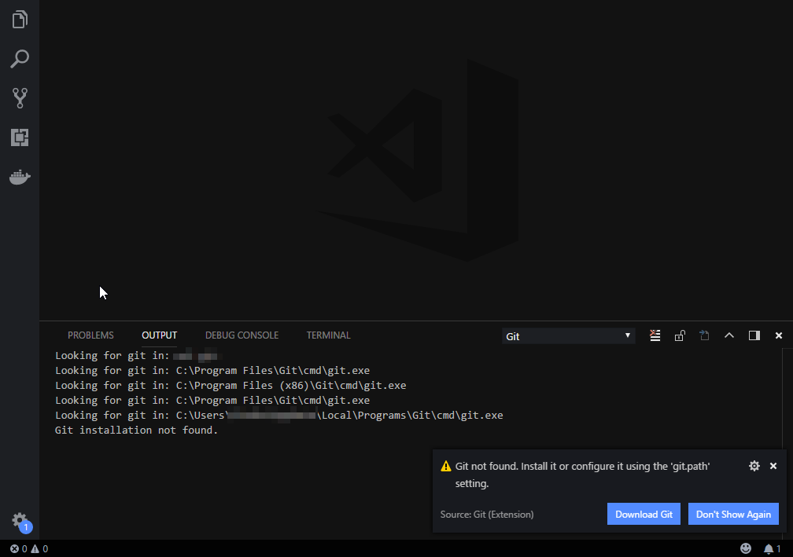

# wsl-git - Use your git binaries from WSL on Windows
I hate installing same programs which do the same thing twice on my machine. WSL is awesome and I do most of my dev stuff from there. So, obviously, I have git installed in WSL. But When I open  VS Code Something like below pops up.


What if you could make VS code make use of git already installed in WSL? Meet **wsl-git**.
- Its a static binary written in Go, which translates git commands from windows to wsl.
- It uses `wsl` command and `wslpath` which is available since RS4 (1803) build of Windows 10.

## Requirements
- Windows 10 64 Bit Build 17134 and above. [RS4 aka Windows 10 1803 Update]
- Windows Subsytem for Linux is enabled and Git is installed in it.

## Build & Release
[](https://ci.appveyor.com/project/tprasadtp/wsl-git)
[](https://github.com/tprasadtp/wsl-git/releases)
[](https://github.com/tprasadtp/wsl-git/releases/LICENSE)
[](https://goreportcard.com/report/github.com/tprasadtp/wsl-git)


## Usage

1. Visual Studio Code

   You need change git path in your `settings.json`.
   ```json
   {
    "git.path": "C:\\path-to\\wsl-git.exe"
   }
   ```
2. From Powershell or cmd

    Put `wsl-git.exe` Somewhere in your path and you should be fine.

## What's not tested
- Muliple WSL distros
- A lot of edge cases


## What's Broken
- Some stuff might break (piping o/p, using bash shell features like xargs etc), but you should be using WSL for them anyways.
- Output colors are gone.
- SSH requires you to setup SSH keys in WSL and not windows. [See Workaround for using Gpg4Win or using Windows SSH client]
- GPG signing requires you to steup keys on WSL and not on Windows. [See Workaround for Gpg4Win below]
- bash escaping is done ony for few cases and not for all chars and edge cases.
- Git credential manager for windows/gnome keyring for storing credentials
- Exit codes are not preserved.
- pre-commit, post commit and other git hooks might not work.

## Signing With GPG4Win

- GPG on windows usues `libassuan`  to mimic unix sockets. It uses a local server running on a random port, and a 16byte `nounce` is written to socket file along with port number.
- Windows did introduce AF_UNIX socket support in RS4(1803) build, which can communicate between WSL and Windows, GPG4Win does not support this yet [Will likely to stay the same for a while now].
- If you are already using [GPG4Win](https://gpg4win.org) and a smartcard like Yubikey, You might want to take a look at [npiperelay](https://github.com/jstarks/npiperelay), there is an open pull request which adds libassuan support via `socat`.
- If you are in a hurry and want to use it now, you can download the binaries from [my fork](https://github.com/tprasadtp/npiperelay/releases/tag/1.0.master.35) follow the instrunction in the repo and you should be able to sign your commits from WSL with your GPG keys on Yubikey. Cool!
- Alternatively you can set your gpg.program to gpg.exe from windows in your `.gitconfig` or `.git/config`
  ```toml
  [gpg]
    program = C:\\Program Files (x86)\\GnuPG\\bin\\gpg.exe
  ```
- For SSH, the above mentioned method seems little buggy for now and hangs many times. So till it is fixed, I recommend using [https://github.com/benpye/wsl-ssh-pageant](https://github.com/benpye/wsl-ssh-pageant) which uses the shiny AF_SOCKET feature or  [NZSmartie's Go version](https://github.com/NZSmartie/wsl-ssh-pageant)

## SSH With Windows SSH client
You cannot use Windows SSH client [included in Windows since 1709], Because this program acts somewhat like a proxy and uses ssh from WSL. You might however try to run ssh.exe from wsl by setting environment variable `GIT_SSH_COMMAND` to windows ssh client.
- Alternatively you can set your core.sshCommnd to ssh.exe from windows in your `.gitconfig` or `.git/config`
  ```toml
  [core]
    sshCommand = C:\\Windows\\System32\\OpenSSH\\ssh.exe
  ```

Do note however that bash does not like carriage returns and this has not been tested.

## GPG4win with Windows SSH client
You can use this [https://github.com/tprasadtp/pipe-ssh-pageant/releases](https://github.com/tprasadtp/pipe-ssh-pageant/releases) and set your `GIT_SSH_COMMAND` to ssh.exe from windows

## BIG FAT WARNING
**DO NOT USE THIS IN SCRIPTS!!**